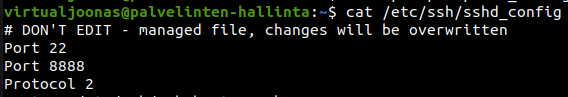
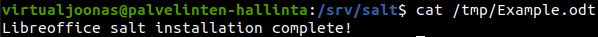
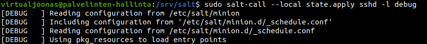
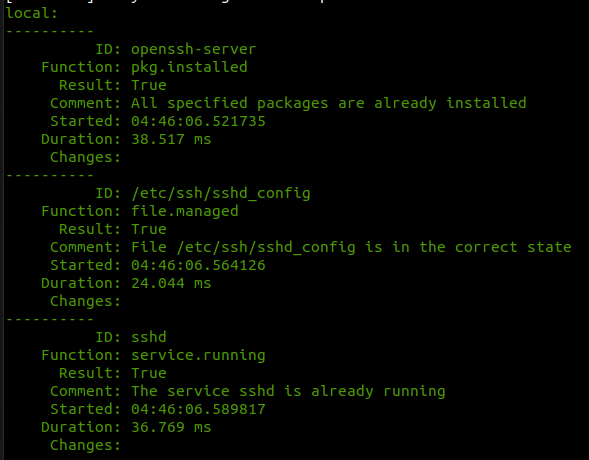

# h2 | Joonas Kulmala

- [h2 | Joonas Kulmala](#h2--joonas-kulmala)
  - [Exercise goals and enviroment](#exercise-goals-and-enviroment)
  - [Exercises](#exercises)
    - [a) Daemon settings](#a-daemon-settings)
      - [Setting up](#setting-up)
      - [Execute phase](#execute-phase)
      - [Checking results](#checking-results)
    - [b) Find command](#b-find-command)
      - [Installing Libreoffice](#installing-libreoffice)
      - [Find](#find)
    - [c) State w/o master-minion architecture](#c-state-wo-master-minion-architecture)
  - [Final thoughts](#final-thoughts)
  - [Sources](#sources)
  - [Edit history](#edit-history)

## Exercise goals and enviroment

## Exercises

### a) Daemon settings

let's create a salt state **sshd** which:
* Installs the package *openssh-server* on my only minion **slave-1**
* Overwrites slave-1's `sshd_config` (/etc/ssh/sshd_config) file as per salt master's configuration file (/salt://sshd_config)
* Makes sure *sshd* service is running

#### Setting up

`sshd.sls` state file:

```
openssh-server:
 pkg.installed
/etc/ssh/sshd_config:
 file.managed:
   - source: salt://sshd_config
sshd:
 service.running:
   - watch:
     - file: /etc/ssh/sshd_config
```

Salt master's `sshd_config` file:

```
# DON'T EDIT - managed file, changes will be overwritten
Port 22
Port 8888
Protocol 2
HostKey /etc/ssh/ssh_host_rsa_key
HostKey /etc/ssh/ssh_host_dsa_key
HostKey /etc/ssh/ssh_host_ecdsa_key
HostKey /etc/ssh/ssh_host_ed25519_key
UsePrivilegeSeparation yes
KeyRegenerationInterval 3600
ServerKeyBits 1024
SyslogFacility AUTH
LogLevel INFO
LoginGraceTime 120
PermitRootLogin no
StrictModes yes
RSAAuthentication yes
PubkeyAuthentication yes
IgnoreRhosts yes
RhostsRSAAuthentication no
HostbasedAuthentication no
PasswordAuthentication yes
PermitEmptyPasswords no
ChallengeResponseAuthentication no
X11Forwarding yes
X11DisplayOffset 10
PrintMotd no
PrintLastLog yes
TCPKeepAlive yes
AcceptEnv LANG LC_*
Subsystem sftp /usr/lib/openssh/sftp-server
UsePAM no
```

#### Execute phase

Now that we have all the files ready, let's try this in action.

```
# Update packages
$ sudo apt-get update

# Apply sshd state to all minions
$ sudo salt '*' state.apply sshd
# Restart sshd service
$ sudo systemctl restart sshd
```

```
slave-1:
----------
          ID: openssh-server
    Function: pkg.installed
      Result: True
     Comment: All specified packages are already installed
     Started: 03:42:57.396226
    Duration: 31.778 ms
     Changes:   
----------
          ID: /etc/ssh/sshd_config
    Function: file.managed
      Result: True
     Comment: File /etc/ssh/sshd_config is in the correct state
     Started: 03:42:57.432514
    Duration: 19.782 ms
     Changes:   
----------
          ID: sshd
    Function: service.running
      Result: True
     Comment: The service sshd is already running
     Started: 03:42:57.453622
    Duration: 36.12 ms
     Changes:   

Summary for slave-1
------------
Succeeded: 3
Failed:    0
------------
Total states run:     3
Total run time:  87.680 ms
```

#### Checking results

The state would appear to been applied succesfully. Let's nagivate to ```/etc/ssh/sshd_config``` and see if it was actually overwritten.

While the contents of `sshd_config` vary between dfferent OS distributions, *Ubuntu 20.14*'s one currently begins like this:

```bash
#       $OpenBSD: sshd_config,v 1.103 2018/04/09 20:41:22 tj Exp $

# This is the sshd server system-wide configuration file.  See
# sshd_config(5) for more information.
...
```

Minion **slave-1**'s however should start with the commented line "# DON'T EDIT - managed file, changes will be overwritten":

```
$ cat /etc/ssh/sshd_config
# DON'T EDIT - managed file, changes will be overwritten
Port 22
Port 8888
Protocol 2
...
```



The task was succesful!

### b) Find command

Let's install another program and afterwards check which files were modified. I'll go for **Libreoffice**.

#### Installing Libreoffice

```
$ apt-cache search libreoffice
# Returns so many packages...
$ libreoffice
Command 'libreoffice' not found, but can be installed with:
...
sudo apt  install libreoffice-common  # version 1:6.4.6-0ubuntu0.20.04.1
...
```

Not the most elegant way, but know we know our target package: **libreoffice-common**.

`libreoffice-sls` file:

```
libreoffice-common:
 pkg.installed
/tmp/Example.odt:
 file.managed:
   - source: salt://Example.odt

```

`Example.odt` file:
```
Libreoffice salt installation complete!
```

Apply state:
```
sudo salt '*' state.apply libreoffice
...
Summary for slave-1
------------
Succeeded: 2 (changed=2)
Failed:    0
------------
Total states run:     2
Total run time:  44.180 s
```
And check:
```
cat /tmp/Example.odt
Libreoffice salt installation complete!
```


#### Find

Let's try using **find** command. I'll make quick changes to `libreoffice.sls` and `Example.odt` files, save them and run the comand.

```
$ cd /srv/salt
$ find -printf "%T+ %p\n"|sort
...
2021-04-13+05:05:02.4107398280 ./libreoffice.sls
2021-04-13+05:08:13.3369651660 ./Example.odt
```

Target file for overwriting:

```
$ cd /tmp
$ find -printf "%T+ %p\n"|sort
...
2021-04-13+05:08:27.9691352810 ./Example.odt
```

First I modified the `/srv/salt/libreoffice.sls` file. Then a few minutes later I also changed `/srv/saltExample.odt` in applied the new changes. This resulted in salt updating the target `/tmp/Example.odt` file.

### c) State w/o master-minion architecture

Let's run **sshd** state on debug mode.

```
$ sudo salt-call --local state.apply sshd -l debug

[DEBUG   ] Reading configuration from /etc/salt/minion
[DEBUG   ] Including configuration from '/etc/salt/minion.d/_schedule.conf'
[DEBUG   ] Reading configuration from /etc/salt/minion.d/_schedule.conf
[DEBUG   ] Using pkg_resources to load entry points
...
[WARNING ] Insecure logging configuration detected! Sensitive data may be logged.
...
...
[DEBUG   ] In saltenv 'base', looking at rel_path 'sshd.sls' to resolve 'salt://sshd.sls'
[DEBUG   ] In saltenv 'base', ** considering ** path '/var/cache/salt/minion/files/base/sshd.sls' to resolve 'salt://sshd.sls'
[DEBUG   ] compile template: /var/cache/salt/minion/files/base/sshd.sls
...
[DEBUG   ] Rendered data from file: /var/cache/salt/minion/files/base/sshd.sls:
...
[DEBUG   ] Results of YAML rendering: 
OrderedDict([('openssh-server', 'pkg.installed'), ('/etc/ssh/sshd_config', OrderedDict([('file.managed', [OrderedDict([('source', 'salt://sshd_config')])])])), ('sshd', OrderedDict([('service.running', [OrderedDict([('watch', [OrderedDict([('file', '/etc/ssh/sshd_config')])])])])]))])

```





As we already got this particular state running without issues there's not much to debug here naturally. Still, reading through I found one **Warning** line about possible insecure data logging.

Still interesting to see the process. It begins by accessing the minion file, which in this case would be `sshd.sls`.

## Final thoughts

Interesting topic on how to further leverage the power of salt.

## Sources

Tero Karvinen - [Apache User Homepages Automatically – Salt Package-File-Service Example](http://terokarvinen.com/2018/apache-user-homepages-automatically-salt-package-file-service-example/index.html?fromSearch=)

## Edit history
