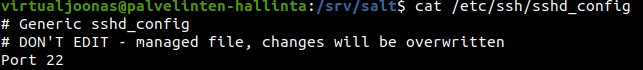

# h2 | Joonas Kulmala

- [h2 | Joonas Kulmala](#h2--joonas-kulmala)
  - [Exercise goals and enviroment](#exercise-goals-and-enviroment)
  - [Exercises](#exercises)
    - [a) Daemon settings](#a-daemon-settings)
      - [Configuring salt master files](#configuring-salt-master-files)
      - [Applying state](#applying-state)
      - [Verifying results](#verifying-results)
    - [b) Find command](#b-find-command)
      - [Configuring salt master files](#configuring-salt-master-files-1)
      - [Applying state](#applying-state-1)
      - [Find commnd](#find-commnd)
    - [c) State w/o master-minion architecture](#c-state-wo-master-minion-architecture)
  - [Final thoughts](#final-thoughts)
  - [Sources](#sources)
  - [Edit history](#edit-history)

## Exercise goals and enviroment

The goal was to further learn about salt and how to use it to install desired packages & and for other tasks. I successfully installed multiple packages and ran some basic tests and diagnostics to evaluate the results.

The previous exercise [h1](/h1/README.md) explains how to setup master-minion architecture.

The exercises for **h2** can be found [here](https://terokarvinen.com/2021/configuration-management-systems-palvelinten-hallinta-ict4tn022-spring-2021/#h2-package-file-service)

## Exercises

### a) Daemon settings

let's create a salt state **sshd** which:
* Installs the package *openssh-server* on salt minions
* Overwrites salt minions' `/etc/ssh/sshd_config` file with salt master's configuration `/salt://sshd_config` file
* Makes sure *sshd* service is running

#### Configuring salt master files

Let's start with setting master files.

My `/srv/salt/sshd.sls` state file looks like this:

```
openssh-server:
 pkg.installed
/etc/ssh/sshd_config:
 file.managed:
   - source: salt://sshd_config
sshd:
 service.running:
   - watch:
     - file: /etc/ssh/sshd_config
```

And `/srv/salt/sshd_config` file:

```
# Generic sshd_config
# DON'T EDIT - managed file, changes will be overwritten
Port 22
Port 8888
Protocol 2
HostKey /etc/ssh/ssh_host_rsa_key
HostKey /etc/ssh/ssh_host_dsa_key
HostKey /etc/ssh/ssh_host_ecdsa_key
HostKey /etc/ssh/ssh_host_ed25519_key
UsePrivilegeSeparation yes
KeyRegenerationInterval 3600
ServerKeyBits 1024
SyslogFacility AUTH
LogLevel INFO
LoginGraceTime 120
PermitRootLogin no
StrictModes yes
RSAAuthentication yes
PubkeyAuthentication yes
IgnoreRhosts yes
RhostsRSAAuthentication no
HostbasedAuthentication no
PasswordAuthentication yes
PermitEmptyPasswords no
ChallengeResponseAuthentication no
X11Forwarding yes
X11DisplayOffset 10
PrintMotd no
PrintLastLog yes
TCPKeepAlive yes
AcceptEnv LANG LC_*
Subsystem sftp /usr/lib/openssh/sftp-server
UsePAM no
```

#### Applying state

Now that we have all the files ready, let's try this in action.

```
# Update packages
$ sudo apt-get update

# Apply sshd state to all minions
$ sudo salt '*' state.apply sshd
# Restart sshd service
$ sudo systemctl restart sshd
```

```
minion-1:
----------
          ID: openssh-server
    Function: pkg.installed
      Result: True
     Comment: All specified packages are already installed
     Started: 10:28:08.851135
    Duration: 39.736 ms
     Changes:   
----------
          ID: /etc/ssh/sshd_config
    Function: file.managed
      Result: True
     Comment: File /etc/ssh/sshd_config updated
     Started: 10:28:08.894573
    Duration: 21.013 ms
     Changes:   
              ----------
              diff:
                  --- 
                  +++ 
                  @@ -1,4 +1,4 @@
                  -#### Generic sshd_config
                  +# Generic sshd_config
                   # DON'T EDIT - managed file, changes will be overwritten
                   Port 22
                   Port 8888
----------
          ID: sshd
    Function: service.running
      Result: True
     Comment: Service restarted
     Started: 10:28:08.956608
    Duration: 112.054 ms
     Changes:   
              ----------
              sshd:
                  True

Summary for minion-1
------------
Succeeded: 3 (changed=2)
Failed:    0
------------
Total states run:     3
Total run time: 172.803 ms
```

#### Verifying results

The state would appear to been applied succesfully. Let's nagivate to ```/etc/ssh/sshd_config``` and see if it was actually overwritten.

While the contents of `sshd_config` vary between dfferent OS distributions, *Ubuntu 20.14*'s one currently begins like this:

```bash
#       $OpenBSD: sshd_config,v 1.103 2018/04/09 20:41:22 tj Exp $

# This is the sshd server system-wide configuration file.  See
# sshd_config(5) for more information.
...
```

My minion **minion-1**'s however should now look the same as `/srv/salt/sshd_config` file.

```
$ cat /etc/ssh/sshd_config
# Generic sshd_config
# DON'T EDIT - managed file, changes will be overwritten
Port 22
...
```



The task was succesful! The configuration file `/etc/ssh/sshd_config` had its contents overwritten by the contents of `/srv/salt/sshd_config` file.

### b) Find command

Let's install another program and afterwards check which files were modified to make sure our changes were properly applied. I'll go for **Libreoffice**.

The task will be to
* install Libreoffice package
* create a document `Example.odt` in user's `/tmp` directory
* use *find* command in terminal to verify which files were modified

#### Configuring salt master files

```
$ apt-cache search libreoffice
# Returns so many packages...
$ libreoffice
Command 'libreoffice' not found, but can be installed with:
sudo apt  install libreoffice-common  # version 1:6.4.6-0ubuntu0.20.04.1
...
```

Not the most elegant way, but know we know our target package: **libreoffice-common**.

`libreoffice.sls` state file:

```
libreoffice-common:
 pkg.installed
/tmp/Example.odt:
 file.managed:
   - source: salt://Example.odt

```

`/srv/salt/Example.odt` file which we want to be created in `/tmp` directory:
```
Libreoffice salt installation complete!
```

#### Applying state

```
$ sudo salt '*' state.apply libreoffice

minion-1:
----------
          ID: libreoffice-common
    Function: pkg.installed
      Result: True
     Comment: The following packages were installed/updated: libreoffice-common
     Started: 10:49:32.783191
    Duration: 34381.391 ms
     Changes:   
              ----------
...
----------
          ID: /tmp/Example.odt
    Function: file.managed
      Result: True
     Comment: File /tmp/Example.odt updated
     Started: 10:50:07.176066
    Duration: 37.02 ms
     Changes:   
              ----------
              diff:
                  New file
              mode:
                  0644

Summary for minion-1
------------
Succeeded: 2 (changed=2)
Failed:    0
------------
Total states run:     2
Total run time:  34.418 s
```

The state was applied successfully. Looking towards the end of the output you can see the summary lines.

  Succeeded: 2 (changed=2)

  Failed:    0

Let's also check `/tmp/Example.odt` to see the created file:

```
cat /tmp/Example.odt
Libreoffice salt installation complete!
```


#### Find commnd

Let's try using **find** to verify which files were changed recently.
 First up are the two files `libreoffice.sls` and `Example.odt` in `/srv/salt` directory:

```
$ cd /srv/salt
$ find -printf "%T+ %p\n"|sort
...
2021-04-15+10:59:54.9729041550 ./libreoffice.sls
2021-04-15+11:00:13.3369651660 ./Example.odt
```
These were created manually by myself. Let's now check the `/tmp/Example.odt` file which was created automatically upon applying the state:

```
$ cd /tmp
$ find -printf "%T+ %p\n"|sort
...
2021-04-15+11:01:30.7133095120 ./Example.odt
```
Seems to be working just fine. `/tmp/Example.odt` was created almost immediately after finishing up configure files and applying salt state.

### c) State w/o master-minion architecture

Let's run **sshd** state on debug mode.

```
$ sudo salt-call --local state.apply sshd -l debug

[DEBUG   ] Reading configuration from /etc/salt/minion
[DEBUG   ] Including configuration from '/etc/salt/minion.d/_schedule.conf'
[DEBUG   ] Reading configuration from /etc/salt/minion.d/_schedule.conf
[DEBUG   ] Using pkg_resources to load entry points
...
[WARNING ] Insecure logging configAdd missing step *find* for **task b**
...
[DEBUG   ] In saltenv 'base', looking at rel_path 'sshd.sls' to resolve 'salt://sshd.sls'
[DEBUG   ] In saltenv 'base', ** considering ** path '/var/cache/salt/minion/files/base/sshd.sls' to resolve 'salt://sshd.sls'
[DEBUG   ] compile template: /var/cache/salt/minion/files/base/sshd.sls
...
[DEBUG   ] Rendered data from file: /var/cache/salt/minion/files/base/sshd.sls:
...
[DEBUG   ] Results of YAML rendering: 
OrderedDict([('openssh-server', 'pkg.installed'), ('/etc/ssh/sshd_config', OrderedDict([('file.managed', [OrderedDict([('source', 'salt://sshd_config')])])])), ('sshd', OrderedDict([('service.running', [OrderedDict([('watch', [OrderedDict([('file', '/etc/ssh/sshd_config')])])])])]))])

```


As we already got this particular state running without issues there's not much to debug here naturally. Still, reading through I found one **Warning** line about possible insecure data logging.

Still interesting to see the process. It begins by accessing the minion file, which in this case would be `sshd.sls`.

## Final thoughts

Interesting topic on how to further leverage the power of salt. It seems to be a reliable and effective way to ensure desired packages are installed, can create files, change settings and so much more. This exercise barely scratched the surface. I did some further reading about salt enviroments and how to better use `top.sls` file.

## Sources

Tero Karvinen - [Apache User Homepages Automatically – Salt Package-File-Service Example](http://terokarvinen.com/2018/apache-user-homepages-automatically-salt-package-file-service-example/index.html?fromSearch=)

SaltStack - [The Top File](https://docs.saltproject.io/en/latest/ref/states/top.html)

## Edit history

13.04.2021
* Add missing step *find* for **task b**
* Fix typos
* Add **exercise goals**, **final thoughts**

15.04.2021
* Better reflect the output by running exercies on an empty machine
* Fix typos
