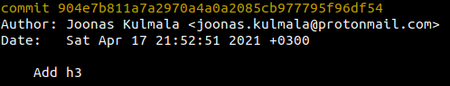
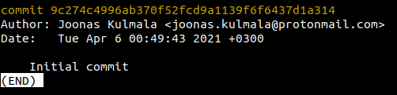
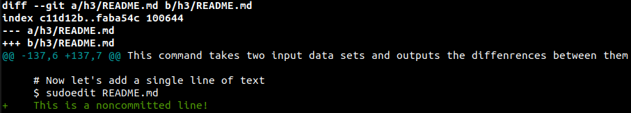
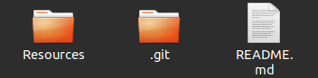

# h3 | Joonas Kulmala

| Tool     | Version           |
| -------- | ----------------- |
| Linux OS | Ubuntu 20.14      |
| GNU bash | 5.0.17(1)-release |
| Git      | 2.25.1            |

<br></br>

- [h3 | Joonas Kulmala](#h3--joonas-kulmala)
  - [Exercise goals and enviroment](#exercise-goals-and-enviroment)
  - [Exercises](#exercises)
    - [a) Markdown](#a-markdown)
      - [After rendering](#after-rendering)
      - [Before rendering](#before-rendering)
    - [d) Basic git commands](#d-basic-git-commands)
      - [git log](#git-log)
      - [git diff](#git-diff)
      - [git blame](#git-blame)
    - [e) Dumb git change](#e-dumb-git-change)
    - [f) New salt module](#f-new-salt-module)
  - [Final thoughts](#final-thoughts)
  - [Sources](#sources)
  - [Edit history](#edit-history)

## Exercise goals and enviroment

This week's topic was to learn about the most widely used version control tool [Git](https://git-scm.com/). Git is an amazing piece of software with easy to learn basics which I've personally used ever since first discovering it. You can get started with just a handful of basic commands such as **git** **init**/**pull**/**push**/**add .**/**commit**.

Git repositories can be hosted & published online on multiple services. One such is [GitHub](https://github.com/) which I am currently using. [Here](https://www.git-tower.com/blog/git-hosting-services-compared/) is a comparison of 14 services by Tobias Günther.

The exercises for h3 can be found on Tero Karvinen's website [here](https://terokarvinen.com/2021/configuration-management-systems-palvelinten-hallinta-ict4tn022-spring-2021/#h3-versionhallinta).

## Exercises

### a) Markdown

The task was to be written in **Markdown**. And so, here we are.

Please check out the [raw](https://raw.githubusercontent.com/JoonasKulmala/Palvelinten-Hallinta/main/h3/README.md) format of this `README.md` file. GitHub automatically renders Markdown, so it should be interesting to see the syntax in plain text.

Here is Markdown's [Basic Syntax](https://www.markdownguide.org/basic-syntax "Basic Syntax") guide and here's GitHub's [Mastering Markdown](https://guides.github.com/features/mastering-markdown/) guide.

#### After rendering

So *what* **is** ~~Markdonw~~ **Markdown** ***capable*** of?

Here's some examples:

    Code blocks

> Quotations!
> 
>> Woo!

Bullet points?
* no?
* yes!

1. Numbered
2. Lists
   1. Like
3. This

[Hyperlinks](https://www.markdownguide.org/basic-syntax/)


[](https://twitter.com/intent/follow?original_referer=https%3A%2F%2Fgithub.com%2FcodeSTACKr&screen_name=JoonasKulmala)

<!--[url_direct]: -->
[twitter]: https://twitter.com/JoonasKulmala

#### Before rendering

Here's the part above in plain text before automatic rendering:

```
So *what* **is** ~~Markdonw~~ **Markdown** ***capable*** of?

Here's some examples:

    Code blocks

> Quotations!
> 
>> Woo!

Bullet points?
* no?
* yes!

1. Numbered
2. Lists
   1. Like
3. This

[Hyperlinks](https://www.markdownguide.org/basic-syntax/)


[](https://twitter.com/intent/follow?original_referer=https%3A%2F%2Fgithub.com%2FcodeSTACKr&screen_name=JoonasKulmala)

<!--[url_direct]: -->
[twitter]: https://twitter.com/JoonasKulmala
```

### d) Basic git commands

Now thay we have a git repository, let's try out some basic git monitoring commands. These will barely scratch the surface; consult [git documentation](https://git-scm.com/doc) for all features.

#### git log

This commands returns commit logs of a git repository. It is basically a timeline to its update history. The command can be specified to narrow view to author, date, file and so on.

In my case this repository has a single contributor and multiple commits:

    $ git log
    commit 904e7b811a7a2970a4a0a2085cb977795f96df54 (HEAD -> main, origin/main)
    Author: Joonas Kulmala <joonas.kulmala@protonmail.com>
    Date:   Sat Apr 17 21:52:51 2021 +0300

    Add h3
    ...
    commit 9c274c4996ab370f52fcd9a1139f6f6437d1a314
    Author: Joonas Kulmala <joonas.kulmala@protonmail.com>
    Date:   Tue Apr 6 00:49:43 2021 +0300

    Initial commit





So what do we have here?
* Secure Hash Algorithm (SHA) hash, unique to each commit
* Author's name and email
* Date and time
* Commit message

Besides git documentation, this [guide](https://careerkarma.com/blog/git-log/) by James Gallagher has some good examples on how to utilize log command.

#### git diff

This command takes two input data sets and outputs the diffenrences between them. Basically it compares e.g. your uncommitted `README.md` file to the committed `README.md` file in your repository. I'll show this in action! Take this file you're currently viewing for instance:

    # When there's no changes made to README.md, git returns nothing
    $ git diff

    # Now let's add a single line of text
    $ sudoedit README.md
    This is a noncommitted line!
    $ git diff

    diff --git a/h3/README.md b/h3/README.md
    index c11d12b..faba54c 100644
    --- a/h3/README.md
    +++ b/h3/README.md
    @@ -137,6 +137,7 @@ This command takes two input data sets and outputs the diffenrences between them
 
    # Now let's add a single line of text
    $ sudoedit README.md
    +    This is a noncommitted line!



Git tells us which file(s) differ from one another and which lines have been **+ added** or **- removed**. Here the only changed line would be the one I just added:

    +    This is a noncommitted line!

#### git blame

This command shows a line specific breakdown of a file's change history. Let's analyze it in action. Take the `README.md` file of this repository for instance:

    # switch to target file's directory
    $ cd /PATH
    $ git blame README.md

    904e7b81 (Joonas Kulmala    2021-04-17 21:52:51 +0300   1) # h3 | Joonas Kulmala
    904e7b81 (Joonas Kulmala    2021-04-17 21:52:51 +0300   2) 
    00000000 (Not Committed Yet 2021-04-20 00:41:38 +0300   3) | Tool | Version            |
    ...


What do we have here?
* Git commit hash
* Author
* Date & time
* Line number & contents

The first 2 lines were committed by me. The 3rd line isn't yet committed, thus it lacks both git commit hash and author.

### e) Dumb git change

Let's make some stupid mistake on purpose and try to resolve it using **git reset --hard**. This command returns **HEAD** to a specified state.

    # Remove tracked file from local repository
    $ git rm README.md
    $ git status
    On branch main
    Changes not staged for commit:
      (use "git add/rm <file>..." to update what will be committed)
      (use "git restore <file>..." to discard changes in working directory)
	          deleted:    README.md
    
    # Undo changes
    $ git reset --hard
    HEAD is now at ceb9b31 h3 progress - d)

Before mistake:



After mistake:


git reset:


So what actually happened?
1.  git rm removed the file `README.md` from working directory
2.  git reset --hard undid the removal by returning HEAD to the state of latest commit ceb9b31~, recreating `README.md`


### f) New salt module

I want to create a salt setup which automatically creates a folder for specific group members and then downloads certain GitHub repositories.

    $ cd /srv/salt
    $ touch my-salt-setup.sls
    $ sudoedit my-salt-setup-sls

    /home/${USER}/Repos:
      file.directory:
        - user:
        - group: developer
        - file_mode: 755
        - dir_mode: 755
        - makedirs: True

However here I ran into problems. I cannot figure out to to create a directory `/Repos` for each user in `/home/user`. I guess it would be easier to to initialize directories for each minion, but a minion may have multiple users after all.

I'll leave this task open until a proper way is figured out...


## Final thoughts

Markdown and basic git commands were quite familiar to me already. I have worked on multiple projects were git & GitHub were used to a degree.

Had some issues with salt, namely trying to create directories for minion under certain conditions. Will update **f)** once I figure it out.

## Sources

Tero Karvinen - [h3](https://www.markdownguide.org/basic-syntax)

Markdown - [Basic Syntax](https://www.markdownguide.org/basic-syntax)

GitHub Guides - [Mastering Markdown](https://guides.github.com/features/mastering-markdown/)

James Gallagher - [Git Log: How to Use It](https://careerkarma.com/blog/git-log/)

Tobias Günther - [14 Git Hosting Services Compared](https://www.git-tower.com/blog/git-hosting-services-compared/)

## Edit history

<!--[url_direct]: -->
[twitter]: https://twitter.com/JoonasKulmala
[github]: https://github.com/
