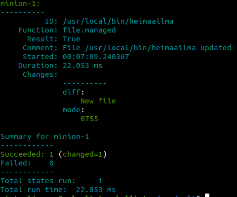
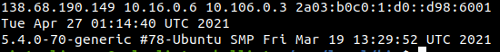
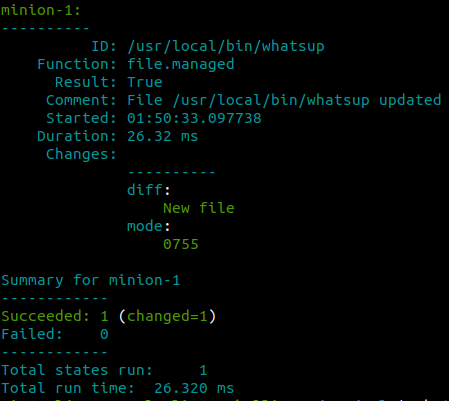
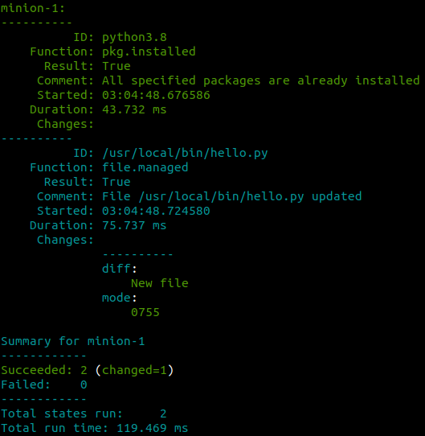
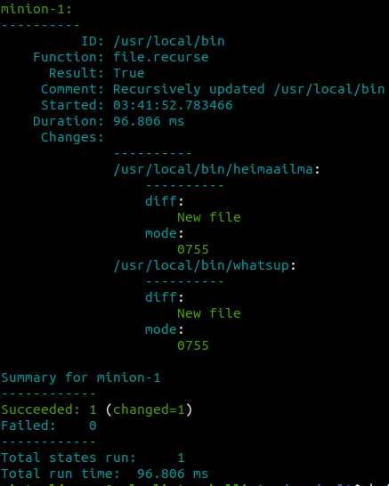

# h4 | Joonas Kulmala

## Exercise goals and enviroment

| Tool     | Version             |
| -------- | ------------------- |
| Linux OS | Ubuntu 20.14        |
| Shell    | Bourne Again (bash) |
| Python   | 3.8.5               |

This week we learnt more about salt and used it to install shell scripts on minions.

Shells scripts are a practical way to create one line commands to execute suprisingly complex tasks.

As always all exercise can be found on Tero Karvinen's website [Configuration Management Systems - Palvelinten Hallinta - Spring 2021](https://terokarvinen.com/2021/configuration-management-systems-palvelinten-hallinta-ict4tn022-spring-2021/#h4-uusi-komento).

## Exercises

### a) Hei komento!

Let's write s simple shell script that prints "hei maailma" and install it on salt minions.

#### Writing the shell script

While it doesn't really matter where script files are located, a good place for them would be `/usr/local/bin`.

	# Create the script file in target directory
	$ sudoedit /usr/local/bin/heimaailma

Writing a basic script is really easy: all the file needs is an instruction for how to run in and the actual command. In this task we want our shell **bash** print *hei maailma*, so let's use the **echo** command.

	# Alter the first line depending on your shell
	#!/bin/bash
	echo hei maailma

	# Give the shell script execute rights
	$ sudo chmod 755 /usr/local/bin/heimaailma

Now let's try the script. Since it was made executable by bash, all we need to do is type in the name of that script, **heimaailma**.

	$ heimaailma
	hei maailma

And it seems to be working just fine. As a side note: try naming scripts short, clear and easy to remember while keeping in mind not to use names which might interfere with Unix commands.

#### Install shell script on salt minions

Now let's setup salt to create the script on minions. We'll need 2 files: `.sls` file and script file.

	# It's a good idea to create a separate directory for each salt states
	$ sudo mkdir /srv/salt/shells

The script file is identical to what we just wrote earlier.

	$ sudoedit heimaailma
	#!/bin/bash
	echo hei maailma

The `.sls` file in YAML would look like this:

	$ sudoedit heimaailma.sls
	/usr/local/bin/heimaailma:
	  file.managed:
	    - source: salt://shells/heimaailma
	    - file_mode: 0755

Now let's try salting:

	# Apply the new state
	$ cd /srv/salt
	sudo salt '*' state.apply shells/heimaailma

Salt state was succesfully applied and a file was created, thus the script should now be working:

	$ heimaailma
	hei maailma

### b) whatsup.sh

Similar to the previous task, let's create a shell script and apply it to minions. This time let's make it display some information about the device rather than print a single string.

#### Writing the shell script

Same as before, I'll first create the script locally and test it:

	# Path to directory for scripts
	$ sudoedit /usr/local/bin/whatsup.sh

	#!/bin/sh
	# Host IP address
	hostname -i
	# Current date and time
	date
	# Kernel version and release
	uname -v -r

And then grant it executable rights:

	$ sudo chmod 755 /usr/local/bin/whatsup.sh
	# Run the script
	$ whatsup.sh

Seems to be working just fine. However, the script name is somewhat tedious so let's go ahead and remove the redundant `.sh` file extension:

	$ sudo mv /usr/local/bin/whatsup.sh /usr/local/bin/whatsup

#### Install shell script on salt minions

Just like before, let's create salt master files and apply a new state.

`/srv/salt/shells/whatsup` script file: 

	#!/bin/sh
	# Host IP address
	hostname -i
	# Current date and time
	date
	# Kernel version and release
	uname -v -r

`srv/salt/shells/whatsup.sls` state file:

	/usr/local/bin/whatsup:
	  file.managed:
        - source: salt://shells/whatsup
        - mode: 0755

Apply the state...

	$ cd /srv/salt
	$ sudo salt '*' state.apply shells/whatsup

...and test the script:

	$ whatsup
	138.68.190.149 10.16.0.6 10.106.0.3 2a03:b0c0:1:d0::d98:6001 
	Tue Apr 27 01:50:37 UTC 2021
	5.4.0-70-generic #78-Ubuntu SMP Fri Mar 19 13:29:52 UTC 2021

### c) hello.py

The task is to write a simple Python script for salt minions. For this we'll need to ensure minions have python.

You can choose to download whichever python version suits your needs. I'll go with `python 3.8` as it's already installed on my current setup.

	# Verify current python3 version
	$ python3 --version

	# Install desired version
	$ sudo apt-get install python3.x

#### Python script file

Let's write a simple *Hello World!* python script:

	$ sudoedit /usr/local/bin/hello.py
	#!/usr/bin/python3

	print('Hello World!')

Give rights to execute:

	$ sudo chmod 755 /usr/local/bin/hello.py

Now let's test it with both python3 and shell commands:

	$ python3 /usr/local/bin/hello.py
	Hello World!
	$ hello.py
	Hello World!

All seems fine.

#### Install python & python script on salt minions

Just like in earlier tasks we'll need script file and `.sls` state file.

Script file:

	# Separate directory for python scripts
	$ sudo mkdir /srv/sal/pythons/
	# Python script
	$ sudoedit /srv/salt/pythons/hello.py

	#!/usr/bin/python3
	Print('Hello World!)

And `.sls` state file in YAML:

	# .sls state
	$ sudoedit /srv/salt/pythons/hellopython.sls

	python3.8:
  	  pkg.installed: []

	/usr/local/bin/hello.py:
  	  file.managed:
        - source: salt://pythons/hello.py
        - mode: 0755

Apply the state:

	sudo salt '*' state.apply pythons/hellopython

And let's run tests:

	# Run Python file
	$ python3 /usr/local/bin/hello.py
	Hello World!

	# Execute Python script
	$ hello.py
	Hello World!

Works like a charm!

### d) Laiskaa skriptailua

I'll make a state which recursively copies a directory down to minions. To save time I'll reuse the shell scripts from **a)** and **b)**.

We'll create a `.sls` state file with **file.recurse** functionality and copy the shell scripts to minions. I'll make some small changes to the file structure. Currently the subdirectory `salt://shells` contains both scripts and `.sls` state files. Since the minion won't be needing the latter, I'll create a subdirectory `salt::/shells/scripts` for the scripts and only pass down its contents.

	# New subdirectory for scripts
	$ sudo mkdir /srv/salt/shells/scripts/
	# Move scripts 'heimaailma' and 'whatsup'
	# sudo mv heimaailma whatsup /scripts

#### Recurse state file

	$ sudoedit /srv/salt/recurse.sls
	/usr/local/bin:
  	  file.recurse:
        - source: salt://shells/scripts
        - include_empty: True
        - file_mode: 0755

Then just apply the state:

	$ cd /srv/salt
	$ sudo salt '*' state.apply recurse

Using **file.recurse** seems quite an effective way to do things.

### e) Intel

Brief review of those who came before.

#### First case

Roope Varttila - [saltpress](https://github.com/sadboirick/saltpress#saltpress)

A module which install Wordpress in minutes. Tested on Xubuntu 16.04.4 LTS x64 live-USB. The process is fairly simple:

1. Clone the repository
2. Run **sudo saltpress.sh** installation script
3. In terminal, firefox 'localhost' (or other browser)

#### Second case

Janne Mustonen - [Oma moduuli h7(Palvelinten hallinta)](https://jannelinux.design.blog/2020/05/19/oma-moduuli-h7/)

A state which install & configures user's programs and whatnot on salt minion. Supposed to work on any Linux distro. Seems like a great idea, I'm actually planning on doing a similar state for myself during this course!

Some listed software and settings:
* Atom editor
* Apache2 webserver & default page
* Git
* Bash config

#### Third case

Teemu Aittomäki - [Salt, Lamp, Eclipse](https://teemuaittomaki.wordpress.com/2020/05/20/palv-hallinta-h7/)

Module which installs LAMP, Eclipse IDE for PHP coding, creates user groups and shared directories/files. Possibly a good way to setup similar or even identical virtual enviroments for a group who will be working on joint projects.

### e) Lukua, ei luottamusta

I'll try the first case by Roope Varttila. It should be a 3-step process:

	# Repository to clone
	$ git clone https://github.com/sadboirick/saltpress.git
	# Navigate to repository
	$ cd saltpress
	# Run the bash script
	$ bash saltpress.sh

This is the result of applying a salt state:

	Summary for local
		-------------
	Succeeded: 10 (changed=11)
	Failed:     7

## Final thoughts

## Sources

Tero Karvinen - [h4 Uusi komento](https://terokarvinen.com/2021/configuration-management-systems-palvelinten-hallinta-ict4tn022-spring-2021/#h4-uusi-komento)

## Edit history
