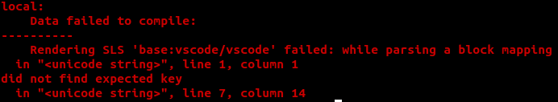
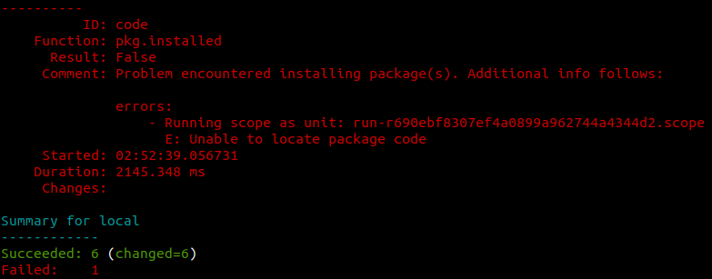
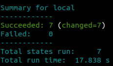

# h5 | Joonas Kulmala

- [h5 | Joonas Kulmala](#h5--joonas-kulmala)
  - [Exercise goals and enviroment](#exercise-goals-and-enviroment)
  - [Exercises](#exercises)
    - [a) Captain obvious](#a-captain-obvious)
      - [Setting up](#setting-up)
      - [Testing in action](#testing-in-action)
    - [b) Sammakko ja skorppioni](#b-sammakko-ja-skorppioni)
      - [Creating salt state, running into issues](#creating-salt-state-running-into-issues)
      - [Fixing issues](#fixing-issues)
    - [c) CSI Pasila](#c-csi-pasila)
    - [d) Tiedän mitä teit viime kesän^H^H^H komennolla](#d-tiedän-mitä-teit-viime-kesänhhh-komennolla)
    - [e) Program /w settings](#e-program-w-settings)
  - [Final thoughts](#final-thoughts)
  - [Sources](#sources)
  - [Edit history](#edit-history)

## Exercise goals and enviroment

| Tool     | Version             |
| -------- | ------------------- |
| Linux OS | Ubuntu 20.14        |
| Shell    | Bourne Again (bash) |

Salt, salt, salt. Practice makes perfect, and so this week is once again all about using salt.

As always all exercises can be found on Tero Karvinen's website [Configuration Management Systems - Palvelinten Hallinta - Spring 2021](https://terokarvinen.com/2021/configuration-management-systems-palvelinten-hallinta-ict4tn022-spring-2021/#h5-aikajana).

## Exercises

### a) Captain obvious

State that installs ten programs via package manager. No need to further configure them. I'll name it **mysetup**. Some of these are already installed automatically or manually probably..

#### Setting up

State `.sls` file and YAML should be familiar from previous tasks. Here's a very basic example on how I did it:

    $ sudo mkdir /srv/salt/mysetup
    # State file
    $ sudoedit /srv/salt/mysetup/mysetup.sls

    # SSH setup
    openssh-server:
     pkg.installed
    /etc/ssh/sshd_config:
     file.managed:
     - source: salt://sshd/sshd_config
    sshd:
     service.running:
     - watch:
       - file: /etc/ssh/sshd_config

    # UFW firewall
    ufw:
     pkg.installed: []

    # Apache2 web server
    apache2:
     pkg.installed: []

    # Grip
    grip:
     pkg.installed: []

    # Node.js JavaScript runtime enviroment
    nodejs:
     pkg.installed: []

    # Mozilla Firefox web browser
    firefox:
     pkg.installed: []

    # LM-sensors cpu monitoring
    lm-sensors:
     pkg.installed: []

    # Libreoffice office suite
    libreoffice-common:
     pkg.installed: []

    # Fortune - fortune cookies on demand.
    fortune-mod:
     pkg.installed: []

    # cmatrix, Matrix visualizer
    cmatrix:
     pkg.installed: []

I've got 12 steps in total; 10 applications and 2 other tasks. Some are already installed.

#### Testing in action

Let's run this in debug mode and see if salt can manage all these applications at once:

    $ sudo salt-call --local state.apply mysetup/mysetup -l debug
    ...
    Summary for local
    -------------
    Succeeded: 12 (changed=6)
    Failed:     0
    -------------
    Total states run:     12
    Total run time:   58.110 s

Everything seems to be working. 12/12 succeeded, 6 were changed. The whole process took roughly a minute to finish, not too bad.

### b) Sammakko ja skorppioni

Let's install a popular editor called [Visual Studio Code](https://code.visualstudio.com/) on salt minion. It has apt repository but it has to be added first. [Visual Studio Code on Linux](https://code.visualstudio.com/docs/setup/linux) has got us covered well here. For Debian and Ubuntu based distributions this can be achieved by

1.  automatically by downloading and installing `.deb` package
2.  manually running a script

If we run **apt-get install** without having the apt repository saved:

    # Package: code
    $ sudo apt-get install code
    ...
    No apt package "code", but there is a snap with that name.
    Try "snap install code"

    E: Unable to locate package code

#### Creating salt state, running into issues

Let's go with option 2 and manually add the apt repository first, then install the application. We have 3 steps to cover:

1.  Add apt repository
2.  Update package list
3.  Install package

I created a state file `/srv/salt/vscode/vscode.sls`:

    'wget -qO- https://packages.microsoft.com/keys/microsoft.asc | gpg --dearmor > packages.microsoft.gpg':
      cmd.run

    'sudo install -o root -g root -m 644 packages.microsoft.gpg /etc/apt/trusted.gpg.d/':
      cmd.run

    'sudo sh -c 'echo "deb [arch=amd64,arm64,armhf signed-by=/etc/apt/trusted.gpg.d/packages.microsoft.gpg] https://packages.microsoft.com/repos/code stable main" > /etc/apt/sources.list.d/vscode.list'':
      cmd.run
     #   -creates: /etc/apt/sources.list.d/vscode.list

    'rm -f packages.microsoft.gpg':
      cmd.run

    'sudo apt-get install apt-transport-https':
      cmd.run

    'sudo apt-get update':
      cmd.run

    # Visual Studio Code
    code:
      pkg.installed: []

However, trying to run it in debug mode I ran into syntax issue:

Testing each command individually I managed to narrow it down to this line:

    'sudo sh -c 'echo "deb [arch=amd64,arm64,armhf signed-by=/etc/apt/trusted.gpg.d/packages.microsoft.gpg] https://packages.microsoft.com/repos/code stable    main" > /etc/apt/sources.list.d/vscode.list'':
     cmd.run

Specifically, the single quotes starting from **'echo...'** that would appear to clash with YAML syntax. Removing them allows salt to progress but it just fails at a later step due to not being able to find the apt repository:

#### Fixing issues

What's the best way to fix issues? Apparently changing stuff until it resolves itself somehow. And so...

As stated above the issue was with the command:

    'sudo sh -c 'echo "deb [arch=amd64,arm64,armhf signed-by=/etc/apt/trusted.gpg.d/packages.microsoft.gpg] https://packages.microsoft.com/repos/code stable    main" > /etc/apt/sources.list.d/vscode.list'':
     cmd.run

I removed the first part **sudo sh -c** for running the created shell script and... it worked. Now when I run the salt state in debug mode again:

    $ sudo salt-call --local state.apply vscode/vscode -l debug
    ...
    Summary for local
    ------------
    Succeeded: 7 (changed=7)
    Failed:    0
    ...

It would seem that Visual Studio Code was installed succesfully.

    $ code --version
    1.55.2
    3c4e3df9e89829dce27b7b5c24508306b151f30d
    x64

All's well that ends well... I suppose? Not quite, but atleast we managed to make it work. I'll research more into the matter and consult others to evaluate the situation properly. I've included the [`vscode.sls`](vscode.sls) file here. Until then...

### c) CSI Pasila

Let's try creating a timeline and looking at which files within a certain directory have been modified. For example:

    $ cd /etc/apt/; sudo find -printf '%T+ %p\n'|sort|tail

    2021-03-29+14:29:00.0000000000 ./trusted.gpg.d/ubuntu-keyring-2012-cdimage.gpg
    2021-03-29+14:29:00.0000000000 ./trusted.gpg.d/ubuntu-keyring-2018-archive.gpg
    2021-04-05+23:08:40.8920000000 ./sources.list
    2021-04-06+00:04:56.6100200430 ./sources.list.d/salt.list
    2021-04-17+06:21:48.9259808110 ./apt.conf.d/01autoremove-kernels
    2021-04-19+23:31:37.1917281990 ./apt.conf.d
    2021-05-04+02:33:40.2167546990 ./sources.list.d
    2021-05-04+03:16:25.1407883530 ./trusted.gpg.d
    2021-05-04+03:16:25.1407883530 ./trusted.gpg.d/packages.microsoft.gpg
    2021-05-04+03:16:25.1487884100 ./sources.list.d/vscode.list

Let's break the command down:
- *cd /etc/;* - change to target directory
- *sudo find* - find command (sudo)
- *-printf* - prints lines while intepreting '\' escapes and '%' directives
- *%T+* - print file's modification time
- *%p* - print file's name
- *\n* - Newline after each entry
- *|sort|tail* - sort by using tail command (default 10 newest)

Let's run a command and see if anything changes when we take the timeline again. I'll create a file in `/etc/apache2` and check the results:

    $ sudoedit /etc/apache2/sites-available/test.conf

    # New timeline
    $ cd /etc/; sudo find -printf '%T+ %p\n'|sort|tail
    2021-05-04+02:33:40.2167546990 ./apt/sources.list.d
    2021-05-04+02:52:06.4440000000 ./salt/minion.d/_schedule.conf
    2021-05-04+03:16:25.1407883530 ./apt/trusted.gpg.d
    2021-05-04+03:16:25.1407883530 ./apt/trusted.gpg.d/packages.microsoft.gpg
    2021-05-04+03:16:25.1487884100 ./apt/sources.list.d/vscode.list
    2021-05-04+03:16:41.2009034990 ./ld.so.cache
    2021-05-04+03:16:41.8249079720 .
    2021-05-04+03:16:41.8249079720 ./mailcap
    2021-05-04+04:20:15.2546628460 ./apache2/sites-available
    2021-05-04+04:20:15.2546628460 ./apache2/sites-available/test.conf

Look at the last 2 entries: those are new! Just by executing a single command 2 changes were made.

### d) Tiedän mitä teit viime kesän^H^H^H komennolla

Let's try changing some settings and afterwards creating a new timeline. I'll modify `/etc/ssh/sshd_config`:

    $ sudoedit /etc/ssh/sshd_config
    # DO NOT EDIT - FILE UPDATED AUTOMATICALLY
    ...

    $ cd /etc/; sudo find -printf '%T+ %p\n'|sort|tail
    ...
    2021-05-04+04:20:15.2546628460 ./apache2/sites-available/test.conf
    2021-05-04+04:47:38.2039504330 ./ssh/sshd_config

I already have a salt state auto configuring `/etc/ssh/sshd_config` file, but for the sake of clarity this is how `/srv/salt/sshd/sshd.sls` looks like:

    openssh-server:
     pkg.installed
    /etc/ssh/sshd_config:
     file.managed:
     - source: salt://sshd/sshd_config
    sshd:
     service.running:
     - watch:
       - file: /etc/ssh/sshd_config

Let's apply the salt state and see if the file gets changed indeed:

    # Apply salt state
    $ sudo salt '*' state.apply sshd/sshd
    # Timeline
    $ cd /etc/; sudo find -printf '%T+ %p\n'|sort|tail
    ...
    2021-05-04+04:20:15.2546628460 ./apache2/sites-available/test.conf
    2021-05-04+04:52:31.4189452560 ./ssh
    2021-05-04+04:52:31.4189452560 ./ssh/sshd_config

Take a peek at previous timeline and this new one, compare them. See how it doesn't list the the modified `sshd_config` twice but rather once?

### e) Program /w settings

## Final thoughts

Practice makes perfect, right? Perhaps not, but I feel like getting better and better with salt. It's an amazing way to automate operations.

## Sources

Tero Karvinen - [h5](https://terokarvinen.com/2021/configuration-management-systems-palvelinten-hallinta-ict4tn022-spring-2021/#h5-aikajana)

Visual Studio Code - [Visual Studio Code on Linux](https://code.visualstudio.com/docs/setup/linux)

SaltStack - [salt.states.cmd](https://docs.saltproject.io/en/latest/ref/states/all/salt.states.cmd.html)

## Edit history
