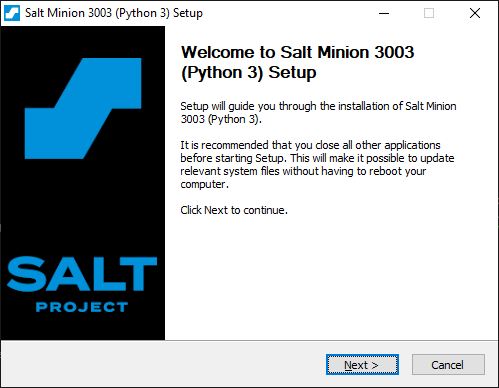
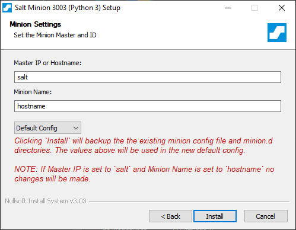
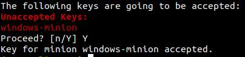
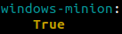
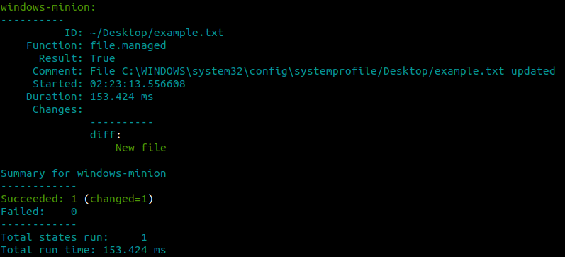
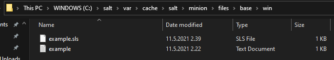

# h6 | Joonas Kulmala

- [h6 | Joonas Kulmala](#h6--joonas-kulmala)
  - [Exercise goals and enviroment](#exercise-goals-and-enviroment)
  - [Exercises](#exercises)
    - [a) Kokeile Saltia Windowsissa](#a-kokeile-saltia-windowsissa)
      - [Establishing master-minion connection](#establishing-master-minion-connection)
      - [Testing salt state](#testing-salt-state)
    - [b) Oman modulin aihe](#b-oman-modulin-aihe)
  - [Final thoughts](#final-thoughts)
  - [Sources](#sources)
  - [Edit history](#edit-history)

## Exercise goals and enviroment

| Tool        | Version      |
| ----------- | ------------ |
| Linux OS    | Ubuntu 20.14 |
| Windows OS  | 10 Home 20H2 |
| Salt Master | 3003         |
| Salt Minion | 3003         |

This week is mostly about preparations for h7, specifically planning our own modules.

I tested salt on Windows operating system. Windows was setup as salt minion whereas Linux was used as salt master. The test was conducted in my **local network**.

## Exercises

The name of the course is 'Linux Servers' but that doesn't mean we shouldn't try using Salt with Windows machines right?

Note: remember to allow connections to salt-master via ports 4505 & 4506. E.g. with UFW:

	$ sudo ufw allow 4505/tcp
	$ sudo ufw allow 4506/tcp

### a) Kokeile Saltia Windowsissa

#### Establishing master-minion connection

For this I'll be using my Windows machine as salt minion and Linux machine as salt master.

Downloading salt-minion on Windows is as easy as it gets - you can grab the `.exe` from here: [Windows](https://docs.saltproject.io/en/latest/topics/installation/windows.html).

Once installed, run Windows PowerShell/similar as administrator and type the following command:

	sc start salt-minion

Salt minion should have started and attempted contant with salt master. Back at Linux salt master, accept the key:

	# -L to see all keys, -A accepts	
	$ sudo salt-key -A

Let's test the connection:

	master $ sudo salt windows-minion test.ping
	windows-minion:
	    True

#### Testing salt state

Now that master has accepted a new minion, let's try out some basic states. I'll attempt to create a file on Windows minion.

`.sls` state file:

	$ sudo mkdir /srv/salt/win
	$ sudoedit /srv/salt/win/example.sls
	~/Desktop/example.txt:
  	  file.managed:
	    - source: salt://win/example.txt

And a simple plain text file:

	$ sudoedit /srv/salt/win/example.txt
	Testing!

Now let's see what happens...

	$ sudo salt windows-minion state.apply win/example

It would appear to have worked. However, when I went to look for the file there was nothing on my Windows desktop. Instead...

I've no idea why the files are created in this path nor why did salt also include `example.sls` file. But atleast we succesfully executed a command on Linux master and created a file on Windows minion.

### b) Oman modulin aihe

My topic is creating salt states which will initialize a fresh Linux (and possibly Windows) machine for my personal needs.

The steps to perform the setup could be:
* Shell script for downloading, installing & configuring salt-minion
* Salt state that fully setups salt-minion machine with various settings, software and so on

What settings and software does it include?
* SSH
* UFW
* Apache
* Tools such as VScode editor
* Other software such as Spotify
* Local files

## Final thoughts

I barely tested salt on Windows so it's difficult to say how well it's supposed to work. Installing and configuring salt minion seemed easy enough, though.

## Sources

Tero Karvinen - [h6](https://terokarvinen.com/2021/configuration-management-systems-palvelinten-hallinta-ict4tn022-spring-2021/#h6-windows)

SaltStack - [Windows](https://docs.saltproject.io/en/latest/topics/installation/windows.html)

## Edit history

12.05.2021
* Add Final thoughts, Sources
* Add Table of Contents
* Typo fixes